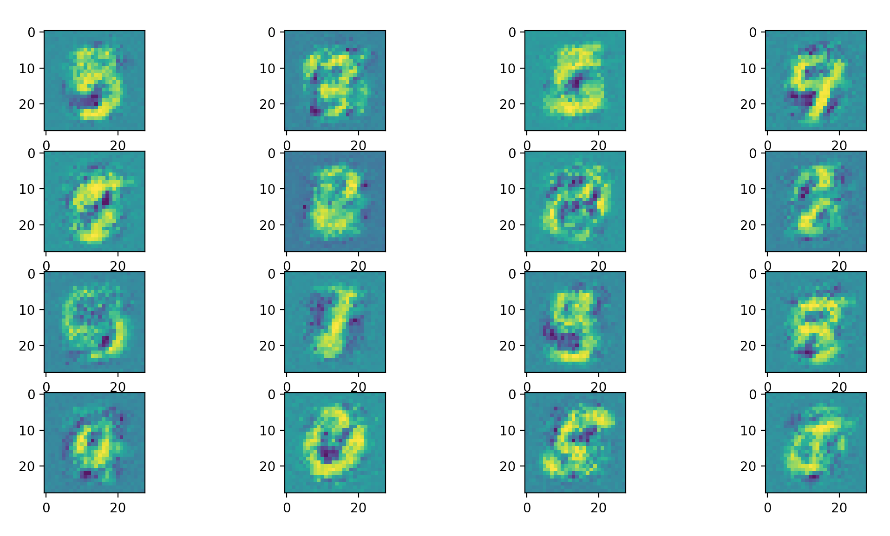

# genierator

Me practicing generative adversarial networks.

## Running the code

0. Make sure you are using Python 3
1. `pip -r install requirements.txt`
2. `python main.py`

The code will train the model and print out the generator's loss as well as the discriminator's accuracy for each epoch.
You want both of them to be small: that means that the images generated by the generator are realistic (discriminator classifies generator's images as real).
After the training 8 sample pictures by the trained generator will be shown.

## TODO

- [ ] Use a more interesting dataset
- [ ] Do some cool parameter tweaking like [this](https://github.com/soumith/ganhacks)
- [ ] Learn a new network model, maybe [CGANS](https://arxiv.org/abs/1411.1784)
- [ ] Use labels when training the discriminator

## Gallery of generated examples:

### MNIST, 10 epochs, relu

### MNIST, 10 epochs, leaky relu

### MNIST, 10 epochs, leaky relu, smoothed labels

### MNIST, 50 epochs, leaky relu, smoothed labels

#### Sources:

[Understanding Generative Adversarial Networks by Naoki Shibuya](https://towardsdatascience.com/understanding-generative-adversarial-networks-4dafc963f2ef) 
  (I use his network architecture and training loop)
